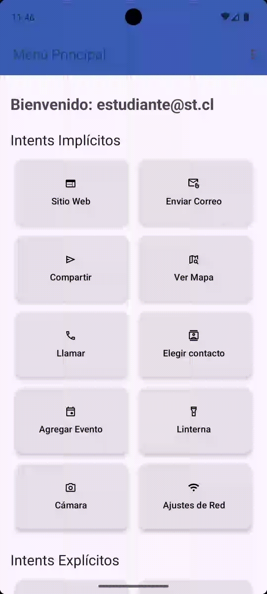
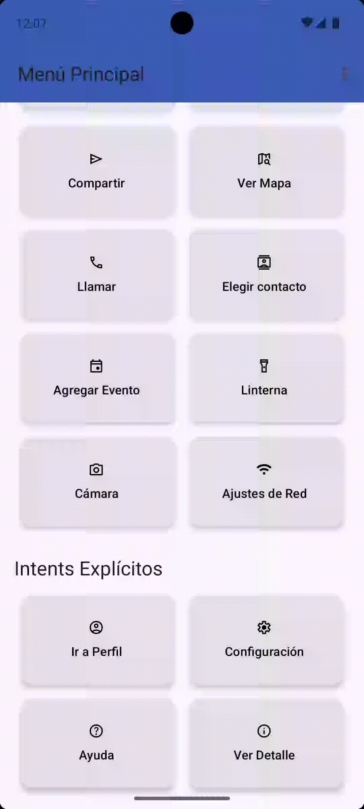

# Prototipo Funcional de Aplicación Android

Este repositorio contiene el código fuente de un prototipo de aplicación para Android, desarrollado como parte de un proyecto académico. La aplicación sirve como una demostración de la implementación de diversos componentes del SDK de Android, con un enfoque principal en la gestión y uso de `Intents` tanto implícitos como explícitos.

## 1. Resumen del Proyecto y Versiones

*   **Descripción:** Aplicación de una sola pantalla principal (`HomeActivity`) que actúa como un menú de funcionalidades. Desde este menú se lanzan diferentes acciones y pantallas para demostrar la interacción con el sistema operativo Android y otras aplicaciones.
*   **Android API Level:** 34 (Upside Down Cake)
*   **Android Gradle Plugin (AGP) Version:** `8.13.0`
*   **Lenguaje:** Java
*   **Componentes Principales:** `Material Design 3`, `ActivityResultLauncher`, `Intents` implícitos y explícitos, manejo de permisos en tiempo de ejecución, `CameraManager`, `ViewBinding` y `Git` para control de versiones.

## 2. Listado de Intents Implementados

A continuación se detallan los `Intents` implementados en el prototipo, separados por su tipo, junto con los pasos para probar cada uno.

### Intents Implícitos (5+ implementados)

A continuación se detallan los 5 intents implícitos implementados como parte central del proyecto, junto con otros intents funcionales que también se encuentran en la aplicación.

1.  **Abrir Ubicación en Mapa (`ACTION_VIEW` con `geo:`)**
    *   **Botón:** "Ver Mapa"
    *   **Acción:** Lanza Google Maps (si está instalado) para mostrar un marcador en una ubicación predefinida (Plaza de Armas, Santiago).
    *   **Pasos de prueba:** Presionar el botón "Ver Mapa". Requiere tener Google Maps instalado.

2.  **Iniciar Llamada (`ACTION_DIAL`)**
    *   **Botón:** "Llamar"
    *   **Acción:** Abre la aplicación de teléfono del dispositivo con el marcador numérico listo para que el usuario ingrese un número.
    *   **Pasos de prueba:** Presionar el botón "Llamar".

3.  **Agregar Evento al Calendario (`ACTION_INSERT`)**
    *   **Botón:** "Agregar Evento"
    *   **Acción:** Abre la aplicación de calendario del usuario con un nuevo evento pre-cargado (título, ubicación y hora), listo para ser guardado.
    *   **Pasos de prueba:** Presionar el botón "Agregar Evento".

4.  **Seleccionar Contacto (`ACTION_PICK`)**
    *   **Botón:** "Elegir contacto"
    *   **Acción:** Abre la agenda de contactos del dispositivo para que el usuario seleccione uno. La app recibe el nombre del contacto y lo muestra en un `Toast`.
    *   **Pasos de prueba:** Presionar el botón "Elegir contacto" y seleccionar un contacto de la lista.

5.  **Abrir Ajustes de Red (`ACTION_WIFI_SETTINGS`)**
    *   **Botón:** "Ajustes de Red"
    *   **Acción:** Abre directamente la pantalla de configuración de Wi-Fi del sistema operativo Android.
    *   **Pasos de prueba:** Presionar el botón "Ajustes de Red".

---
**Otros intents implícitos funcionales en el proyecto:**
*   **Abrir Sitio Web:** Abre una URL en el navegador.
*   **Enviar Correo:** Abre un cliente de correo con datos pre-rellenados.
*   **Compartir Texto:** Permite compartir un texto simple con otras apps.
*   **Encender Linterna:** Interactúa con el hardware de la cámara.
*   **Abrir Cámara:** Lanza una `Activity` interna para tomar fotos.

### Intents Explícitos (3 implementados)

1.  **Abrir Pantalla de Detalles con Datos (`DetalleActivity`)**
    *   **Botón:** "Ver Detalle"
    *   **Acción:** Navega a una segunda pantalla (`DetalleActivity`) y le pasa datos (título y descripción) usando `putExtra()`. La pantalla de destino muestra estos datos.
    *   **Pasos de prueba:** Presionar el botón "Ver Detalle".

2.  **Abrir Pantalla de Configuración (`ConfigActivity`)**
    *   **Botón:** "Configuración"
    *   **Acción:** Simula la navegación a una pantalla de ajustes interna de la aplicación, mostrando una `Toolbar` con un botón funcional de "Atrás".
    *   **Pasos de prueba:** Presionar el botón "Configuración" y luego usar la flecha de "Atrás" en la barra superior para volver.

3.  **Abrir Pantalla con Animación Personalizada (`DetalleActivity`)**
    *   **Botón:** "Ver Detalle"
    *   **Acción:** Navega a la pantalla de detalle aplicando una transición de deslizamiento horizontal (`slide_in_right` y `slide_out_left`).
    *   **Pasos de prueba:** Presionar el botón "Ir a Perfil" para ver la animación de entrada. Presionar "Atrás" para ver la animación de salida.

## 3. Capturas de Pantalla

Aquí puedes ver algunas de las pantallas principales de la aplicación:

   <strong>Pantalla Principal (Home)</strong> 
   

   <strong>Selector de Contactos</strong> 
   

   <strong>Pantalla de Ayuda</strong> 
   

   <strong>Pantalla de Ver Detalle con Animación</strong> 
   

---
